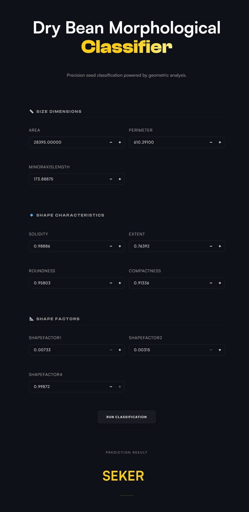

# 🌱 Dry Bean Morphological Classifier

 

  

### Intelligent Agricultural Seed Classification Using Machine Learning

A production-ready machine learning pipeline that classifies seven distinct varieties of dry beans from camera-derived morphological features using advanced preprocessing, outlier capping, statistical validation, and classification modeling.

 

**🔗 Live Application** 
👉 [Launch Streamlit App](https://dry-bean-classifier.streamlit.app/)

**📓 Kaggle Notebook** 
👉 [View Full Project Notebook](https://www.kaggle.com/code/preetndr/dry-bean-classification)

**📊 Dataset Source** 
👉 [Dry Bean Dataset](https://www.kaggle.com/datasets/nimapourmoradi/dry-bean-dataset-classification)

 

---

# ✨ Project Overview

This project presents a complete end-to-end machine learning workflow for predicting the exact variety of dry beans based on physical shape, size, and compactness metrics.

The system combines:

* Advanced preprocessing pipelines
* Custom outlier capping and transformations
* Statistical analysis and Multicollinearity validation
* SMOTE for severe class imbalance
* Classification modeling
* Cross-validation and Hyperparameter Tuning
* Production deployment with Streamlit

The final model is deployed as an interactive web application that allows users to perform both single-bean inference and batch classification in real-time.

---

# 🖥️ Application Preview

 
 

<i>Interactive ML-powered seed classification interface deployed with Streamlit.</i>

The deployed Streamlit application provides an interactive interface for categorizing dry beans in real-time using geometric specifications and the trained machine learning pipeline.

---

# 🎯 Problem Statement

In the agricultural sector, classifying dry beans manually is labor-intensive, time-consuming, and prone to human error. Different bean varieties often share highly similar physical characteristics, making visual sorting difficult at industrial scales.

The objective of this project is to build a machine learning pipeline capable of learning the non-linear morphological boundaries between bean varieties and accurately automating the classification process using camera-derived sensor data.

---

# 🧠 Machine Learning Workflow

## 1. Data Collection

The dataset consists of measurements gathered through camera-based computer vision algorithms. It captures geometric dimensions and shape profiles.

* Classes: 7 (SEKER, BARBUNYA, BOMBAY, CALI, DERMASON, HOROZ, SIRA)
* Original Feature Count: 16 geometric characteristics
* Refined Feature Count: 10 strictly independent metrics

Dataset Metrics:
* Size: Area, Perimeter, Axis Lengths
* Shape Proportions: Solidity, Extent, Roundness, Compactness
* Mathematical Forms: ShapeFactors (1-4)

---

## 2. Data Validation & Quality Checks

The dataset underwent multiple validation steps before model training:

### ✔ Missing Value & Duplicate Analysis
* Verified missing-value consistency across all features.
* Confirmed zero duplicate observations.

### ✔ Statistical Profiling
* Distribution analysis revealed extreme right-skewness on features like `Area` and `Perimeter`.
* Boxplots identified massive clusters of extreme outliers in sensor measurements.
* Countplots revealed significant target class imbalance (e.g., 'DERMASON' vs 'BOMBAY').

### ✔ Multicollinearity Detection
* Correlation heatmaps revealed perfect collinearity (r > 0.95) between twin features (e.g., `Area` and `ConvexArea`, `Compactness` and `ShapeFactor3`).
* Mathematical redundancy was eliminated via a strict feature-dropping strategy to stabilize distance-based algorithms.

---

 

# ⚙️ Feature Selection & Preprocessing

Custom engineering and strict selection criteria were introduced to improve predictive capability and pipeline stability:

| Operation | Description |
| --- | --- |
| `OutlierCapper` | Custom Scikit-Learn transformer that strictly caps anomalous sensor data at the 1st and 99th percentiles. |
| `Yeo-Johnson Transform` | Power transformation selectively applied to skewed features (Area, Perimeter, etc.) via `ColumnTransformer`. |
| `SMOTE` | Synthetic Minority Over-sampling to construct decision boundaries for underrepresented bean varieties. |
| `Feature Purge` | Dropped mathematical "twins" (`ConvexArea`, `EquivDiameter`, etc.) to cure severe multicollinearity. |

These preprocessing variables significantly improved the model’s ability to separate morphologically overlapping bean classes.

---

 

# 🔒 Zero Data Leakage Architecture

This project was intentionally designed to eliminate data leakage and preserve evaluation integrity.

### Why the pipeline is leak-proof:

* The dataset was split into training and testing subsets **before** any preprocessing, scaling, or outlier capping were applied.
* All preprocessing operations—including `SMOTE` resampling—were wrapped inside a unified `imblearn Pipeline`, ensuring transformations learned strictly from training data.
* Synthetic data generation (SMOTE) was applied *only* to the training subset during cross-validation, guaranteeing the test set remained untouched and representative of real-world scenarios.

This guarantees that evaluation metrics reflect true generalization performance.

---

# 🧪 Preprocessing Pipeline

The final production pipeline includes:

~~~python
Pipeline([
    ('outlier_capper', OutlierCapper(lower_percentile=0.01, upper_percentile=0.99)),
    ('transform', transformer),
    ('scale', StandardScaler()),
    ('model', SVC(kernel='rbf', class_weight='balanced'))
])
~~~
*(Note: SMOTE was dynamically injected during tuning for models lacking native class-weight support).*

### Pipeline Components

* Custom Percentile Outlier Capper
* Target Feature Selection (10 features)
* Yeo-Johnson Power Transformations
* Standard Scaling
* Classification Model Training

---

 

# 📈 Exploratory Data Analysis

The notebook includes detailed EDA covering:

* Distribution plots and Histograms
* Outlier analysis via Boxplots
* Correlation heatmaps
* Pairwise feature clustering (Pairplots)
* Target imbalance analysis
* Statistical summaries

### Key Findings

* **Non-Linear Boundaries:** The scatter relationships between shape metrics (e.g., Roundness vs Compactness) show distinct curves, predicting linear models would struggle.
* **Cluster Overlap:** Smaller bean varieties like 'DERMASON' and 'SIRA' overlap heavily in central dense masses, while 'BOMBAY' forms entirely isolated outlier clusters.
* **Extreme Multicollinearity:** `Compactness` and `ShapeFactor3` shared a flawless 1.0 correlation, requiring immediate removal to prevent artificial feature importance inflation.

---

 

# 🤖 Models Evaluated

Multiple classification algorithms were trained, tuned, and compared:

| Model | Train Accuracy | Test Accuracy | F1 Score | Overfitting (Y/N) |
| :--- | :--- | :--- | :--- | :--- |
| **SVM (Curved)** | 0.934 | 0.927 | **0.938** | N |
| Gradient Boosting (Ensemble) | 0.958 | 0.919 | 0.931 | N |
| Random Forest (Ensemble) | 0.995 | 0.917 | 0.929 | **Y** |
| Logistic Regression | 0.922 | 0.914 | 0.927 | N |
| K-Nearest Neighbors | 0.950 | 0.914 | 0.927 | N |
| Naive Bayes | 0.906 | 0.906 | 0.920 | N |
| Decision Tree | 1.000 | 0.887 | 0.901 | **Y** |
| AdaBoost (Ensemble) | 0.879 | 0.867 | 0.879 | N |

### Final Selected Model

✅ **Support Vector Machine (Curved - RBF Kernel)**

The tuned SVM pipeline achieved the strongest overall balance between:

* Peak Macro F1-Score (handling class imbalance effectively)
* Ability to map curved, non-linear class boundaries
* Stability during cross-validation
* Zero overfitting tendencies (Train/Test delta < 0.01)

---

 

# 📊 Model Performance

## Final Evaluation Metrics (Optimized SVM)

| Metric | Value |
| --- | --- |
| Test Accuracy | **0.939** |
| Train Accuracy | **0.940** |
| Macro F1-Score | **0.938** |

### Hyperparameter Tuning Results

* Exhaustive `GridSearchCV` confirmed default-like parameters (`C=1`, `gamma='scale'`) are mathematically optimal for this heavily scaled feature space. 
* The absolute alignment between training and testing performance indicates rock-solid generalization and validates the strict outlier capping logic.

---

 

# 🚀 Streamlit Deployment

The trained pipeline was serialized using `pickle` and deployed through a fully interactive Streamlit application.

### Application Features

* Single-bean real-time morphological classification
* Batch Processing via CSV uploads
* Custom UI/UX styling with centered aesthetics
* Smooth animations and 3D hover effects
* Dynamic fallback self-healing models
* Production-ready inference pipeline

### Live Demo

🔗 [https://dry-bean-classifier.streamlit.app/](https://dry-bean-classifier.streamlit.app/)

---

 

# 🛠️ Tech Stack

## Machine Learning
* Scikit-learn
* Imbalanced-learn (SMOTE)
* NumPy
* Pandas

## Visualization
* Matplotlib
* Seaborn

## Deployment
* Streamlit
* Pickle Serialization

## Development
* Python 3.11
* Jupyter Notebook
* Kaggle

---

 

# 📂 Repository Structure

~~~text
dry-bean-classifier/
│
├── .gitignore
├── README.md
├── app.py
├── code.ipynb
├── dataset.xlsx
├── model.pkl
└── requirements.txt
~~~

---

 

# ⚡ Installation

## Clone Repository

~~~bash
git clone https://github.com/preetndr/dry-bean-classifier.git
cd dry-bean-classifier
~~~

## Install Dependencies

~~~bash
pip install -r requirements.txt
~~~

## Run Streamlit Application

~~~bash
streamlit run app.py
~~~

---

 

# 🔍 Example Prediction Workflow

1. Select geometric configurations via interactive sliders.
2. Submit configuration through the "Classify Bean" interface.
3. Pipeline instantly performs data capping, scaling, Yeo-Johnson transforms, and SVM inference.
4. Predicted bean variety and physical description are generated instantly.

---

 

# 📌 Future Improvements

Potential future enhancements include:

* **Real-time IoT Integration:** Deploying via a FastAPI endpoint to receive live measurements directly from factory conveyor belt sensors.
* **Deep Learning Upgrade:** Bypassing tabular feature extraction by training a CNN directly on raw overhead images of the beans.
* **Quality Grading:** Expanding the model to predict grade/quality (defects/discoloration) alongside variety.
* Automated retraining workflows via Airflow.

---

 

# 🙌 Acknowledgements

* Original Dry Bean Dataset Researchers
* Streamlit Framework
* Scikit-learn and Imbalanced-learn Documentation
* Open-source Python ML ecosystem

---

### ⭐ If you found this project interesting, consider starring the repository.

